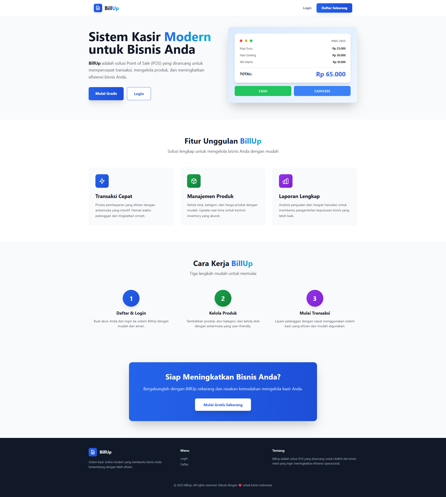

<p align="center">
  
</p>

<h1 align="center">BillUp - Point of Sales System</h1>

<p align="center">
  
  
  
  
  
</p>

<p align="center">
  <strong>Aplikasi Point of Sales (POS) berbasis web yang modern dan user-friendly</strong><br>
  Dibangun dengan Laravel dan TailwindCSS untuk Uji Sertifikasi Kompetensi (USK)
</p>

<p align="center">
  <a href="#-features">Features</a> •
  <a href="#-tech-stack">Tech Stack</a> •
  <a href="#-installation">Installation</a> •
  <a href="#-usage">Usage</a> •
  <a href="#-screenshots">Screenshots</a> •
  <a href="#-contributing">Contributing</a> •
  <a href="#-license">License</a>
</p>

---

## 📋 Tentang Project

**BillUp** adalah aplikasi Point of Sales (POS) berbasis web yang dirancang untuk memudahkan proses transaksi penjualan, manajemen produk, pencatatan riwayat transaksi, dan pelaporan keuangan secara digital. Aplikasi ini dikembangkan sebagai bagian dari Uji Sertifikasi Kompetensi (USK) dengan fokus pada kemudahan penggunaan, efisiensi, dan keamanan data.

### 🎯 Tujuan Project
- Menyediakan sistem kasir yang cepat dan efisien
- Memudahkan manajemen produk dan kategori
- Menyediakan laporan keuangan yang akurat
- Meningkatkan produktivitas dalam proses transaksi penjualan

---

## ✨ Features

### 🔐 Authentication & Authorization
- **Login & Register** dengan desain modern (gradient UI)
- **Role-based Access Control** (Admin & Cashier/User)
- **Profile Management** (update nama, email, password)
- **Logout Confirmation** dengan SweetAlert2

### 👨‍💼 Admin Features
- **Dashboard** dengan statistik lengkap (total penjualan, transaksi, produk)
- **Product Management**
  - CRUD produk dengan upload gambar
  - Filter berdasarkan kategori
  - Tracking stok produk
  - SweetAlert confirmation untuk delete
- **Category Management**
  - CRUD kategori dengan icon
  - SweetAlert confirmation untuk delete
- **Transaction History**
  - Melihat semua transaksi dari semua kasir
  - Detail transaksi lengkap
  - Filter berdasarkan tanggal
- **Financial Reports** (dapat di-toggle)
  - Laporan penjualan harian/mingguan/bulanan
  - Grafik penjualan
  - Produk terlaris

### 👤 Cashier/User Features
- **POS Interface** yang modern dan responsive
  - Search & filter produk by category
  - Keranjang belanja dengan quantity input manual
  - Validasi stok real-time dengan SweetAlert
  - Diskon transaksi (dapat di-toggle)
  - Pembayaran cash/cashless (dapat di-toggle)
  - Perhitungan kembalian otomatis
- **Invoice/Struk**
  - Generate invoice dengan nomor unik
  - Print-friendly design
  - Detail transaksi lengkap
- **Transaction History**
  - Melihat riwayat transaksi sendiri
  - Detail transaksi per invoice

### 🎨 UI/UX Features
- **Responsive Design** - Mobile, Tablet, Desktop friendly
- **SweetAlert2 Notifications** - Notifikasi yang cantik dan informatif
- **Modern Authentication Pages** - Gradient backgrounds dengan icon inputs
- **Mobile Menu** - Hamburger menu untuk mobile devices
- **Toast Notifications** - Session flash messages dengan SweetAlert
- **Smooth Animations** - Hover effects dan transitions

### ⚙️ Feature Toggles (Configurable)
Fitur-fitur berikut dapat diaktifkan/dinonaktifkan melalui `config/features.php`:
- ✅ Discount (Potongan harga)
- ✅ Transaction History
- ✅ Cashless Payment (Pembayaran non-tunai)
- ✅ Financial Reports (Laporan keuangan)

---

## 🛠️ Tech Stack

### Backend
- **Laravel 12.42.0** - PHP Framework
- **PHP 8.4.13** - Programming Language
- **MySQL** - Database Management System

### Frontend
- **Blade Template Engine** - Laravel's templating engine
- **TailwindCSS 3.x** - Utility-first CSS framework
- **Alpine.js** - Lightweight JavaScript framework
- **SweetAlert2** - Beautiful popup notifications

### Build Tools & Dependencies
- **Vite** - Frontend build tool
- **pnpm** - Fast, disk space efficient package manager
- **Composer** - PHP dependency manager

### Development Environment
- **Laragon** - Local development environment
- **Git** - Version control

---

## 📦 Installation

### Prerequisites
Pastikan Anda sudah menginstall:
- PHP >= 8.4.13
- Composer
- Node.js & pnpm
- MySQL
- Laragon (recommended) atau web server lainnya

### Step-by-Step Installation

1. **Clone Repository**
   ```bash
   git clone https://github.com/Nyxaria-27/BillUp_POS-System.git
   cd BillUp_POS-System
   ```

2. **Install PHP Dependencies**
   ```bash
   composer install
   ```

3. **Install Node Dependencies**
   ```bash
   pnpm install
   ```

4. **Environment Setup**
   ```bash
   # Copy .env.example ke .env
   copy .env.example .env
   
   # Generate application key
   php artisan key:generate
   ```

5. **Database Configuration**
   
   Buka file `.env` dan sesuaikan konfigurasi database:
   ```env
   DB_CONNECTION=mysql
   DB_HOST=127.0.0.1
   DB_PORT=3306
   DB_DATABASE=billup
   DB_USERNAME=root
   DB_PASSWORD=
   ```

6. **Create Database**
   
   Buat database baru di MySQL dengan nama `billup`

7. **Run Migrations**
   ```bash
   php artisan migrate
   ```

8. **Create Storage Symlink**
   ```bash
   php artisan storage:link
   ```

9. **Seed Database (Optional)**
   
   Jika Anda ingin menambahkan data dummy:
   ```bash
   php artisan db:seed
   ```

10. **Build Assets**
    ```bash
    pnpm run build
    ```

11. **Run Application**
    ```bash
    # Development
    php artisan serve
    
    # Build assets in watch mode (terminal terpisah)
    pnpm run dev
    ```

12. **Access Application**
    
    Buka browser dan akses: `http://localhost:8000`

---

## 🚀 Usage

### Demo Credentials

Gunakan credentials berikut untuk testing:

**Admin Account:**
- Email: `admin@billup.com`
- Password: `password`

**Cashier Account:**
- Email: `kasir@billup.com`
- Password: `password`

### Quick Start Guide

1. **Login** menggunakan credentials di atas
2. **Admin**:
   - Akses Dashboard untuk melihat statistik
   - Kelola Produk dan Kategori dari sidebar
   - Lihat Riwayat Transaksi semua kasir
   - Akses Laporan Keuangan (jika diaktifkan)
3. **Kasir**:
   - Akses halaman POS (Point of Sales)
   - Pilih produk dan tambahkan ke keranjang
   - Input quantity manual atau gunakan tombol +/-
   - Masukkan diskon (opsional)
   - Proses pembayaran
   - Print invoice/struk

### Feature Configuration

Edit file `config/features.php` untuk mengaktifkan/menonaktifkan fitur:

```php
return [
    'discount' => env('FEATURE_DISCOUNT', true),
    'transaction_history' => env('FEATURE_TRANSACTION_HISTORY', true),
    'cashless_payment' => env('FEATURE_CASHLESS_PAYMENT', false),
    'financial_reports' => env('FEATURE_FINANCIAL_REPORTS', true),
];
```

---

## 📸 Screenshots

### Welcome Page
<p align="center">
  
  <br>
  <em>Halaman landing dengan desain modern dan informative</em>
</p>

> **Note**: Untuk menambahkan screenshot lainnya, buat folder `screenshots/` di root project dan tambahkan gambar-gambar berikut:
> - `login.png` - Halaman login dengan gradient blue
> - `register.png` - Halaman register dengan gradient green
> - `admin-dashboard.png` - Dashboard admin dengan statistik
> - `products.png` - Halaman manajemen produk
> - `pos.png` - Interface Point of Sales
> - `invoice.png` - Contoh invoice/struk

---

## 📁 Project Structure

```
BillUp/
├── app/
│   ├── Http/
│   │   ├── Controllers/
│   │   │   ├── Admin/          # Admin controllers
│   │   │   └── User/           # Cashier controllers
│   │   └── Middleware/
│   │       └── CheckRole.php   # Role-based authorization
│   └── Models/                 # Eloquent models
│
├── config/
│   └── features.php            # Feature toggles
│
├── database/
│   ├── migrations/             # Database schemas
│   └── seeders/                # Sample data
│
├── public/
│   ├── build/                  # Compiled assets (Vite)
│   └── storage/                # Product images
│
├── resources/
│   ├── css/
│   │   └── app.css             # Tailwind CSS
│   ├── js/
│   │   ├── app.js              # Main JavaScript (Alpine.js, SweetAlert2)
│   │   └── bootstrap.js
│   └── views/
│       ├── admin/              # Admin views
│       ├── auth/               # Authentication pages
│       ├── cashier/            # Cashier/POS views
│       └── layouts/            # Layout templates
│
├── routes/
│   ├── web.php                 # Web routes
│   └── auth.php                # Authentication routes
│
└── storage/
    └── app/public/             # File storage (product images)
```

---

## 🤝 Contributing

Kontribusi sangat diterima! Jika Anda ingin berkontribusi:

1. Fork repository ini
2. Create feature branch (`git checkout -b feature/AmazingFeature`)
3. Commit changes (`git commit -m 'Add some AmazingFeature'`)
4. Push to branch (`git push origin feature/AmazingFeature`)
5. Open Pull Request

### Contribution Guidelines

- Pastikan code mengikuti PSR-12 coding standard
- Tulis unit tests untuk fitur baru
- Update dokumentasi jika diperlukan
- Gunakan commit messages yang jelas dan deskriptif

---

## 🐛 Known Issues & Troubleshooting

### Issue: Assets tidak ter-load setelah clone
**Solution**: Jalankan `pnpm run build` untuk compile assets

### Issue: Error 500 saat upload gambar
**Solution**: Pastikan sudah menjalankan `php artisan storage:link`

### Issue: Database connection error
**Solution**: Periksa konfigurasi `.env` dan pastikan MySQL service running

### Issue: SweetAlert tidak muncul
**Solution**: Clear browser cache dan jalankan `pnpm run build`

---

## 📝 License

This project is licensed under the MIT License - see the [LICENSE](LICENSE) file for details.

---

## 👨‍💻 Author

**Dwi Wahyu Ramadhan**

- GitHub: [@Nyxaria-27](https://github.com/Nyxaria-27)
- Email: dwiwahyuramadhan27@gmail.com
- Instagram: [@sturn_ra](https://instagram.com/sturn_ra)

---

## 🙏 Acknowledgments

- Laravel Team untuk framework yang luar biasa
- TailwindCSS untuk utility-first CSS framework
- SweetAlert2 untuk beautiful notifications
- Komunitas open source yang selalu membantu

---

## 📊 Project Stats


---

<p align="center">
  Made with ❤️ for Uji Sertifikasi Kompetensi (USK)
</p>

<p align="center">
  <sub>Built with Laravel 12 • TailwindCSS • SweetAlert2</sub>
</p>
